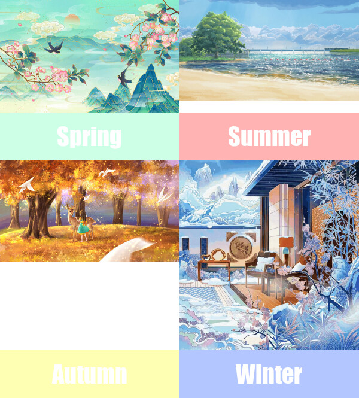

# **Hi! Everyone!** 

*Welcome to my website!* 

In this page I will show my meme.🦄🌺🌸🌼

## Here is my meme 

## The code of my meme 🌟

'''
library(magick)

#picture 1
Spr <- "https://online-pic.51mo.com/preview/element/00/01/25/03/E-1250330-DF983DBB.jpg?imageView2/2/w/600/q/90" %>%
  image_read(Spr) %>% image_scale(300)

#sq1
Spr_text <- image_blank(width = 300, height = 80, color = "#ccffe6") %>%
  image_annotate(text = "Spring", color = "#ffffff",size = 40, font = "Impact", gravity = "center")

#picture 2
Sum <- "http://img.tukuppt.com/png_preview/00/08/37/YaLABUqR0n.jpg!/fw/780" %>%
  image_read(Sum) %>% image_scale(400)

# sq2
Sum_text <- image_blank(width = 300, height = 80, color = "#ffb3b3") %>%
  image_annotate(text = "Summer", color = "#ffffff",size = 40, font = "Impact", gravity = "center")

# picture 3
Aut <- "https://img95.699pic.com/photo/40162/5881.jpg_wh300.jpg" %>%
  image_read(Aut) %>% image_scale(300)

# sq3
Aut_text <- image_blank(width = 300, height = 80, color = "#ffffb3") %>%
  image_annotate(text = "Autumn", color = "#ffffff",size = 40, font = "Impact", gravity = "center")

# picture 4
Win <- "https://www.yxhart.com/upload/default/20200825/8584d7ae3f199fc76ec66508f5f54ed3.jpg" %>%
  image_read(Win) %>% image_scale(300)

# sq4
Win_text <- image_blank(width = 300, height = 80, color = "#b3c6ff") %>%
  image_annotate(text = "Winter", color = "#ffffff",size = 40, font = "Impact", gravity = "center")

# row1
r1 <- c(S1,S2) %>% image_append()

#row2
r2 <- c(Spr_text,Sum_text) %>% image_append()

#row3
r3 <- c(aun, win) %>% image_append()

#row4
r4 <- c(Aut_text, Win_text) %>% image_append()

Season <- c(r1,r2,r3,r4) %>%
  image_append(stack = TRUE)
image_write(Season, "my_meme.png")

'''

